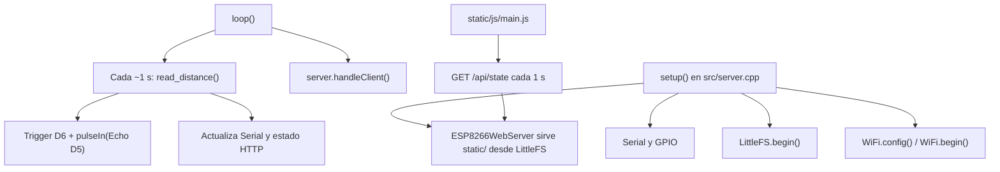

---
tags:
  - redes-ii
  - arquitectura
  - simulacion
---

# Simulación y arquitectura del sistema

## Resumen

La solución implementada permite observar el mismo dashboard con el ESP8266 o con un modelo local. La documentación del proyecto queda organizada en tres capas:

1. `README.md` para el panorama operativo del repositorio.
2. `Documentacion/Redes II - Servidor web - Informe del proyecto.md` para la fundamentación académica del sistema.
3. `redes-ii-vault/` para la arquitectura, el backlog y los criterios de terminado.

La solución implementada permite observar el mismo dashboard con el ESP8266 o con un modelo local:

1. El firmware del ESP8266 mide el sensor y publica su estado por HTTP.
2. El simulador de PC usa Python para presentar estados controlables de sensor, Wi-Fi y LittleFS.

Ambos entornos comparten la interfaz y el contrato JSON del dashboard, pero **no ejecutan el mismo código de aplicación**: el simulador no ejecuta el ELF ni mide tiempos, periféricos o uso de memoria del ESP8266. El build cruzado y sus límites de RAM/IRAM/flash siguen siendo validaciones obligatorias.

El backlog priorizado y el criterio de terminado están en [[funcionalidades-pendientes]]. No conviene presentar una placa distinta como simulación exacta del ESP8266: la meta de la herramienta local es previsualizar el comportamiento observable del dashboard y algunos escenarios del dispositivo.

## Arquitectura actual observada



| Área | Implementación actual |
|---|---|
| Arranque y coordinación | `src/server.cpp`: `setup()` y `loop()` |
| Sensor | `read_distance()` genera el pulso ultrasónico y mide el Echo con `pulseIn()` |
| Red | Wi-Fi en modo estación con IP estática; servidor en puerto 80 |
| Archivos | `ESP8266WebServer::serveStatic()` sirve el contenido de LittleFS generado desde `static/` |
| Interfaz | `static/index.html`, `static/js/main.js` y `static/css/style.css`; dashboard de placa/sensor que consulta `/api/state` |
| Compilación | `xmake.lua`; toolchain Xtensa LX106 y linker script de ESP8266 NodeMCU |

El dashboard consulta la distancia de firmware y diferencia timeout de una medición válida. El firmware aún no implementa umbral ni transición de alarma.

## Hallazgos que condicionan cualquier simulación

1. **Pinout corregido para NodeMCU.** El firmware ahora usa TRIG D6/GPIO12 y ECHO D5/GPIO14. El cableado todavía debe confirmarse y adaptarse a esos pines antes de probar el sensor.
2. **Nivel eléctrico del Echo.** Si se utiliza un HC-SR04 alimentado a 5 V, su Echo puede entregar 5 V. El ESP8266 trabaja con GPIO de 3,3 V; se debe adaptar el nivel antes de conectarlo.
3. **Timeout diferenciado.** `pulseIn()` devuelve cero si vence el timeout; el firmware ahora publica una lectura inválida con `distance_cm: null` en vez de informar `0 cm`.
4. **El arranque puede quedar bloqueado.** El montaje de LittleFS y la configuración de Wi-Fi fallidos terminan en un bucle infinito; la conexión Wi-Fi espera indefinidamente. Los escenarios de error deben expresar explícitamente si ese comportamiento se conserva o se cambia por reintento/estado degradado.
5. **La medición bloquea temporalmente el bucle.** El timeout de Echo es 30 ms y el muestreo se ejecuta cada segundo. Las solicitudes HTTP comparten ese bucle y pueden esperar durante la medición.

## Arquitectura implementada

Archivos actuales:
```text
src/server.cpp             # firmware ESP8266; GET /api/state
static/                    # página y estilos/script compartidos con simulación
simulator/model.py         # estado simulado y entradas virtuales
simulator/server.py        # HTTP local: UI, API de estado y controles de prueba
tests/test_simulator.py    # pruebas de estados, muestreo y API
```

`static/` sirve la misma interfaz en la placa y en el simulador. El firmware expone `GET /api/state` con uptime y la lectura más reciente; el simulador sirve el mismo dashboard, crea estado sintético cada segundo y añade `POST /api/controls` para variar distancia, Echo, Wi-Fi y montaje de LittleFS. Las actualizaciones del modelo son validadas antes de aplicarse, y el acceso concurrente está protegido. El modelo acepta un reloj inyectado para que la cadencia y los errores puedan probarse determinísticamente. No hay dependencias Python externas.

Arranque local desde la raíz:

```sh
# Terminal 1
python3 -m simulator.server

# Terminal 2: pruebas, no requiere el servidor interactivo
python3 -m unittest discover -s tests -v

# Opcional: cambiar puerto/interfaz (usar localhost en desarrollo)
python3 -m simulator.server --port 8081
```

Abrir `http://127.0.0.1:8080` (o el puerto elegido). La UI muestra una placa esquemática, medición, uptime, conectividad y eventos; los controles solo aparecen cuando el endpoint informa que es simulación. Python 3.10 o superior y librería estándar, sin `pip install`.

### Controles visibles del simulador

- **Distancia:** deslizador 2–400 cm. Se refleja tras la siguiente muestra (cadencia de 1 s).
- **Echo responde:** desactivar simula timeout de 30 ms; la lectura pasa a inválida/null, no a cero.
- **Wi-Fi disponible:** desactivar mueve el estado a `waiting_wifi` y detiene nuevas muestras.
- **LittleFS monta:** desactivar mueve el estado a `halted_filesystem`, imitando el `HALT()` de arranque actual.
- **Reiniciar:** restablece uptime y temporizador de muestra. Las posiciones de controles se conservan.
- **Eventos:** historial limitado al más reciente de 30 eventos.

La simulación de Wi-Fi/LittleFS representa escenarios de **fallo al arranque**, no una caída de red real después de conectar. La distancia puede cambiarse desde la pantalla; el límite sirve como rango nominal del HC-SR04, no implica alarma.

### API de desarrollo

El servidor local escucha solo en `127.0.0.1:8080` por defecto.

```sh
curl -s http://127.0.0.1:8080/api/state
curl -s -X POST http://127.0.0.1:8080/api/controls \
  -H 'Content-Type: application/json' \
  -d '{"distance_cm": 25}'
curl -s -X POST http://127.0.0.1:8080/api/controls \
  -H 'Content-Type: application/json' \
  -d '{"echo_available": false}'
```

Los controles admitidos son `distance_cm` (finito, 2–400), `echo_available`, `wifi_available`, `filesystem_mounts` (booleanos) y `reboot` (booleano). JSON inválido, propiedades desconocidas y valores fuera de rango devuelven HTTP 400; cuerpos vacíos o mayores a 1024 bytes se rechazan. Los controles existen únicamente en el simulador; el firmware ofrece solo lectura.

### Usar el dashboard desde la placa

```sh
xmake server
xmake flash -p /dev/ttyUSB0
```

Al conectar el NodeMCU a la Wi-Fi configurada, abrir en un navegador la IP estática definida por `SERVER_IP` en `.env` (en la configuración por defecto: `http://192.168.0.53/`). El endpoint de telemetría es `GET /api/state`. Los controles de simulación no aparecen cuando el firmware responde `simulator: false`. No se ejecuta un flasheo físico durante los tests.

La simulación no ejecuta el ELF ni emula el core Arduino. Reproduce el contrato observable del dashboard y algunos estados de arranque para desarrollar sin hardware. Su perfil de placa describe límites nominales; no calcula el uso de RAM/IRAM ni el tiempo exacto del procesador.

## Mapeo físico actual

Se reemplazaron los GPIO 21/22, que no existen en la variante NodeMCU ESP8266, por **TRIG D6/GPIO12** y **ECHO D5/GPIO14**. Son GPIO disponibles para uso digital en esta variante. Ajustar el cableado del sensor para coincidir antes de usar la placa; adaptar el Echo a 3,3 V si el módulo lo alimenta a 5 V.

La página muestra distancia y recepción/timeout del Echo, no una alarma derivada de un umbral. El firmware todavía no implementa la clasificación “Normal/Movimiento detectado” de los datos de ejemplo anteriores; el umbral y la política siguen pendientes de definición.

El modelo permite variar distancias de 2 a 400 cm, deshabilitar Echo y simular arranque detenido si LittleFS falla o si Wi-Fi no conecta. Reiniciar restablece el uptime y la ventana de medición. Estos son escenarios de visualización/prueba del contrato, no emulación eléctrica del HC-SR04 ni del firmware Xtensa.

Para no penalizar al ESP8266:

- Mantener estructuras pequeñas, buffers de tamaño fijo y memoria estática.
- No incluir componentes de simulación, serializadores pesados ni dependencias de PC en el binario del firmware.
- Evitar asignación dinámica, `std::function`, excepciones y RTTI en rutas de tiempo real. El proyecto ya compila sin excepciones ni RTTI.
- Mantener el ciclo de medición no bloqueante en lo posible y comparar `millis()` con resta unsigned, como se hace actualmente, para tolerar el rollover del reloj.
- Medir siempre el firmware real con las herramientas de tamaño de `lib/esp8266/tools/sizes.py`. La simulación en PC no conoce el coste de Xtensa, IRAM ni Wi-Fi.

Si más adelante se añade lógica de alarma, conviene extraer la política a una función pura pequeña y compartirla entre firmware y pruebas nativas. No hace falta un framework de abstracción.

## Cómo se ejecutarían las pruebas

Las pruebas nativas actuales avanzan un reloj virtual y ejercitan los siguientes comportamientos:

| Escenario | Entrada simulada | Comportamiento a verificar |
|---|---|---|
| Primera lectura y cadencia | Reloj de prueba en 999 y 1000 ms | No muestrea antes del primer segundo; actualiza al cumplirse el intervalo |
| Echo ausente | Desactivar Echo y avanzar el reloj | Timeout explícito; no informar `0 cm` como distancia |
| Fallo de arranque | Desactivar montaje de LittleFS o disponibilidad Wi-Fi | `halted_filesystem` o `waiting_wifi` |
| Controles inválidos | Distancia fuera de rango / tipo incorrecto | Error sin aplicar cambios parciales |
| HTTP local | GET `/`, GET `/api/state`, POST `/api/controls` | Dashboard y contrato HTTP disponibles; validar entrada |

Quedan como pruebas futuras la política de alarma (todavía no definida), pérdida de conectividad después del arranque, lecturas intermitentes y escenarios de rollover del `millis()` real del ESP8266.

El contrato `GET /api/state` ya alimenta la interfaz tanto en simulación como desde el firmware. El servidor local también implementa la API de controles y pruebas HTTP del contrato. La UI no muestra controles de inyección cuando detecta el firmware real. Ver [[funcionalidades-pendientes]] para cobertura que aún falta, requisitos por definir y futuras mejoras.

## Validación por capas

1. **Unitarias nativas:** estado simulado, cadencia de un segundo, timeout, validación de controles y reinicio con reloj falso.
2. **Integración nativa:** servidor local y contrato HTTP comprobados contra el mismo dashboard.
3. **Compilación de placa:** `xmake server` verifica el build para Xtensa, genera LittleFS e imagen de flash combinada.
4. **Presupuesto de placa:** observar el reporte RAM/IRAM/flash del build; tras añadir el endpoint web se midieron 29.728/80.192 bytes de RAM y 60.287/65.536 bytes de IRAM en el entorno inspeccionado. IRAM tiene poco margen y se debe volver a medir tras cada cambio. No usar estos valores como presupuesto universal para otra revisión/toolchain.
5. **Prueba física final:** comprobar que el cableado use D6/D5, adaptar tensión de Echo, sensor, Wi-Fi y montaje de LittleFS. Ninguna prueba de PC certifica niveles eléctricos ni tiempos exactos.

Wokwi u otro simulador de circuitos puede servir como complemento visual cuando su MCU y sus periféricos coincidan con la placa seleccionada, pero una adaptación a otra familia sirve solo como demostración. QEMU tampoco sustituye las bibliotecas Arduino, el Wi-Fi y los periféricos del ESP8266 de este proyecto.

## Orden de implementación recomendado

1. Cablear el sensor a D6/D5 y verificar el adaptador de nivel de Echo.
2. Especificar qué significa “movimiento detectado”, umbrales, histéresis y tratamiento de lecturas perdidas.
3. Extraer lógica de alarma pura compartible entre firmware y pruebas si la política acordada lo justifica.
4. Mantener el simulador y las pruebas nativas; no aceptar su salida como evidencia de consumo de recursos en la placa.
5. Mantener build Xtensa y sus métricas como condición obligatoria para cada cambio.

## Referencias del repositorio

- `src/server.cpp`
- `static/index.html`
- `static/js/main.js`
- `xmake.lua`
- `lib/esp8266/variants/nodemcu/pins_arduino.h`
- `AGENTS.md`
